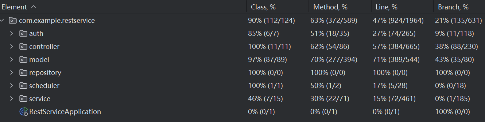

# Final Report 68

## Metrics

Lines of Code: 

Number of source files: 

Cyclomatic complexity: 

Number of dependencies: 

## Documentation

[用户文档](https://github.com/HQJ2221/PlACo/blob/main/UserDocument/UserDocument-zh.md)

**开发文档：**

[后端文档](https://github.com/HQJ2221/PlACo/blob/main/DevDocument_backend.md)

[前端文档](https://github.com/HQJ2221/PlACo/blob/main/DevDocument_frontend.md)

## Tests

### 测试截图

该测试文件使用了以下技术/工具/框架/方法进行自动化测试：

JUnit 5: 用于编写和运行单元测试，提供了 @Test、@BeforeEach 等注解。
    
Mockito: 用于模拟（mock）依赖项（如 UserRepository、CourseRepository 等），通过 @Mock 和 @InjectMocks 实现依赖注入和行为模拟。
    
MockitoExtension: JUnit 5 的扩展，用于集成 Mockito，简化 mock 对象的管理。
    
Spring Security: 测试 MySecurityService 中的权限验证逻辑，模拟 Authentication 对象以验证用户身份和角色。
    
Assertions: 使用 JUnit 的 assertTrue 和 assertFalse 验证测试结果。
    
Mocking 技术: 通过 when(...).thenReturn(...) 配置模拟对象的返回行为，隔离测试对象与实际数据库的交互。
    
单元测试方法: 每个测试方法聚焦于单一功能（如 isSubmissionOwner、isTeacherByAssignment），确保高覆盖率和独立性。

[测试源代码](https://github.com/HQJ2221/PlACo/tree/backend/main/src/test/java/com/example/restservice)

## Build

Technology/Tools/Frameworks: 使用了 Spring Boot 框架作为主要开发框架，结合了 Gradle 作为构建工具。

前后端自动构建过程使用GitHub Actions构建workflow，编译打包为Docker镜像并push到Docker Hub。

[前端 Dockerfile](https://github.com/HQJ2221/PlACo/blob/frontend/release/Dockerfile)

[后端 Dockerfile](https://github.com/HQJ2221/PlACo/blob/backend/release/Dockerfile)

## Deployment

使用Docker, Kubernetes进行容器化部署，管理负载均衡和数据库等多个容器。

[k8s deployment.yml](https://github.com/HQJ2221/PlACo/blob/documentation/deployment.yml)

部署截图：

