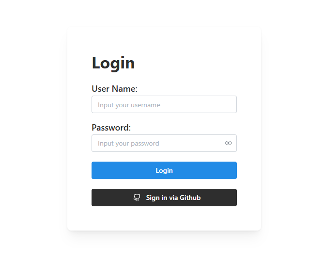
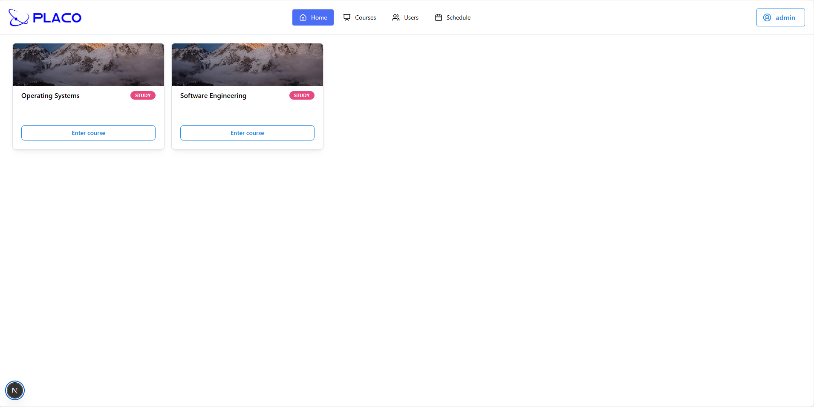
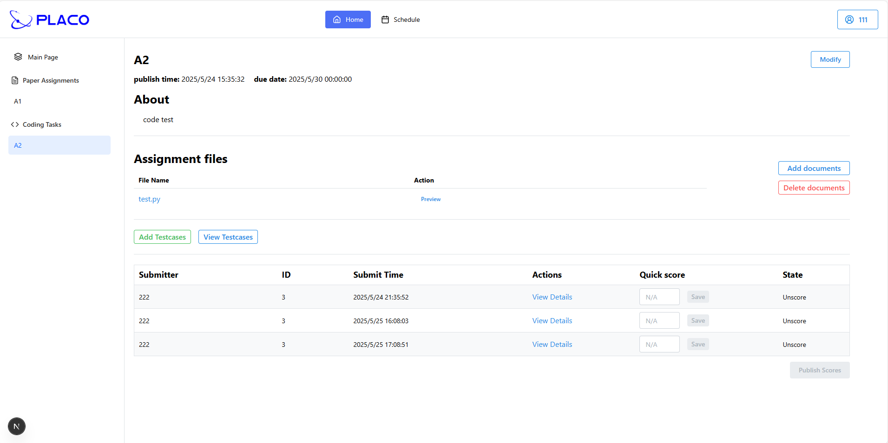
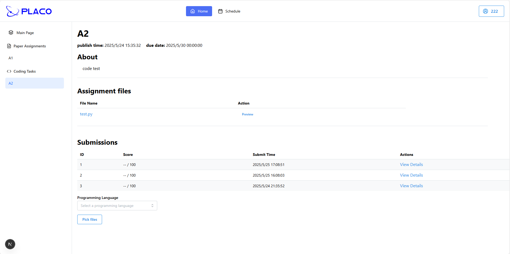

# PlACo 文档

[EN](UserDocument.md) | ZH

- [简介](#简介)
- [安装](#安装)
- [使用指南](#使用指南)
  - [登录](#登录)
  - [用户](#用户)
    - [课程讲师](#课程讲师)
    - [课程学生](#课程学生)
  
  - [管理员](#管理员)
  
- [贡献](#贡献)
- [许可证](#许可证)

## 简介

- **PlACo**（**Pl**atform of **A**ssignment and **Co**ding）是一个集成化平台，拥有简洁的用户界面
- 我们的设计结合了 Blackboard（作业提交平台）和 Online Judge（编程评测平台）的功能
- 我们支持的功能包括（详见[使用指南](#使用指南)）：
  - 自定义设置
  - 作业提交
  - 编程题目提交
  - 在线评测


## 安装

### 从源码搭建项目

1. 克隆项目

```bash
git clone [repo-address] -b frontend/main
```

2. `npm` 下载包

```bash
npm install
```

3. 在开发模式下运行前端

```bash
npm run dev
```

4. 我们应用常规 `next.js` 框架，因此可以参考 `next.js` 官网的部署方式进行部署（如用 `node.js` 服务器，Docker 等）


## 使用指南

### 登录

- 在 `Login` 页面，用户可以输入**用户名**和**密码**进行登录。
- 如果您是新用户，可通过 Github 直接注册登录，我们将为您自动创建新账户！



### 用户

**简介**

- 用户在 *PlACo* 中拥有基础权限。根据课程中的 `Role` 不同，用户会获得不一样的权限。



#### 日程与设置

- 在:house:主页面（登录后）的顶部导航栏中，点击`Calendar`即可进入:calendar:日程页面。
- 您可以通过表格查看**所有课程即将截止的作业**。
- 点击 `View Calendar` 按钮，可在日历中查看作业截止日期。
- 点击 `Add Entry` 按钮，你可以添加自定义日程
  - 输入日程名，结束日期等必要信息，就可以创建一个新日程


---

- 在主页面右上角的菜单中，点击`设置`即可进入设置页面。
- 您可以在此修改账户的 `username` 和 `password`，输入新值后点击`更新`即可。
- 提供暗黑模式开关，默认模式为亮色，但系统会保存您的个性化设置。

#### 课程讲师

> :fountain_pen: **重要提示！** 在特定课程中，您的"角色"可能是教师（`INSTRUCTOR`）或学生（`STUDENT`）。
>
> :fountain_pen: **重要提示！** 您的角色由管理员指定，可在:house:主页面的"课程卡片"中查看。

- 若您是课程的**讲师**（INSTRUCTOR），可在课程首页按以下步骤创建作业：
  - 点击`创建作业`按钮
  - 填写所有必填项（如作业标题、类型、截止日期、满分和最大提交次数）
    - 作业类型可设为`文本`（TEXT）或`代码`（CODE），不同类型对应不同操作。
  - 可上传文件作为作业文档，也支持创建后追加文档。
  - 可启用OCR服务，将学生的手写版提交转换为电子版后进行查重。
- 提供**导航栏**用于选择并操作特定作业。
- 对于**文本**作业，您可以：
  - 点击`修改`按钮调整发布时间、截止时间、满分和OCR启用状态。
  - 点击`预览`按钮查看已上传的文档。
  - 点击`添加文档`或`删除文档`管理文件。
  - :fountain_pen: **重要提示！** 查看学生提交信息：
    - 点击`查看详情`链接预览学生提交的文件（如有）
    - 输入分数并点击`保存`按钮进行评分
    - 若**截止时间已过**且**所有学生作业已评分**，点击`发布分数`即可向学生公开成绩。
- 对于**代码**作业，您可以：
  - **同样**修改作业信息并管理文档
  - 点击`添加测试用例`按钮添加测试用例：
    - 设置测试用例的所有必要配置（页面内提供详细说明）
    - 可上传输入文件和预期输出文件作为测试用例
    - 将测试用例加入**测试用例列表**（**支持批量添加！**）
    - 最后点击`确认全部`一次性上传所有测试用例
  - 点击`查看测试用例`按钮可删除测试用例或查看详细信息，如：
    - CPU时间限制、全局时间限制、内存限制、堆栈限制
    - 输入文件内容、输出文件内容、启用的属性
  - 提交列表中展示学生提交记录，您可查看学生提交的文件，但**无法手动评分**（系统通过评测服务自动评分）。



#### 课程学生

- 作为课程学生，您可以**提交作业或代码**并**查看成绩**。
- 对于**文本**作业，您可以：
  - 点击`选择文件`上传作业文件
  - 页面仅显示最新提交（右侧显示提交时间）
  - 若教师已发布成绩，可**在右侧查看分数**
- 对于**代码**作业，您可以：
  - 点击`选择文件`并**选择编程语言**进行提交
  - 页面按提交时间降序显示所有提交记录
  - 点击`查看详情`链接可查看每次提交的详细结果及所有测试用例的评测结果

> 代码作业由自动评测服务评分，因此提交前**必须**选择编程语言



### 管理员

**简介**

- 管理员拥有普通用户的所有权限，并额外具备注册新用户和创建课程的权限。
- 相比普通用户，管理员在顶部导航栏中多出2个标签页。


#### 课程管理

- 点击`课程`标签页管理课程
- 您可以：
  - 点击现有课程以添加/删除成员（支持搜索选择讲师或学生）
  - 点击`创建课程`按钮新建课程：
    - 可通过初始化课程属性（名称、讲师、学生）创建单个课程
    - 也可上传格式规范的**CSV文件**批量创建多个课程

#### 用户管理

- 点击`用户`标签页管理用户
- 您可以：
  - 查看用户信息并停用账户（停用后用户无法登录）
  - 点击`新建`按钮注册新用户：
    - 可通过初始化用户属性（邮箱、用户名、密码、角色）创建单个用户
    - 也可上传格式规范的**CSV文件**批量创建多个用户


## 贡献

### 贡献者

- 当前团队共有4名成员：[fest6](https://github.com/fest6), [LatiosInAltoMare](https://github.com/LatiosInAltoMare), [zxx3312](https://github.com/zxx3312), [HQJ2221](https://github.com/HQJ2221)。

- 两名成员负责后端开发，另外两名负责前端。全员参与测试，项目经理完成部署工作。


## 许可证

[MIT License](LICENSE)